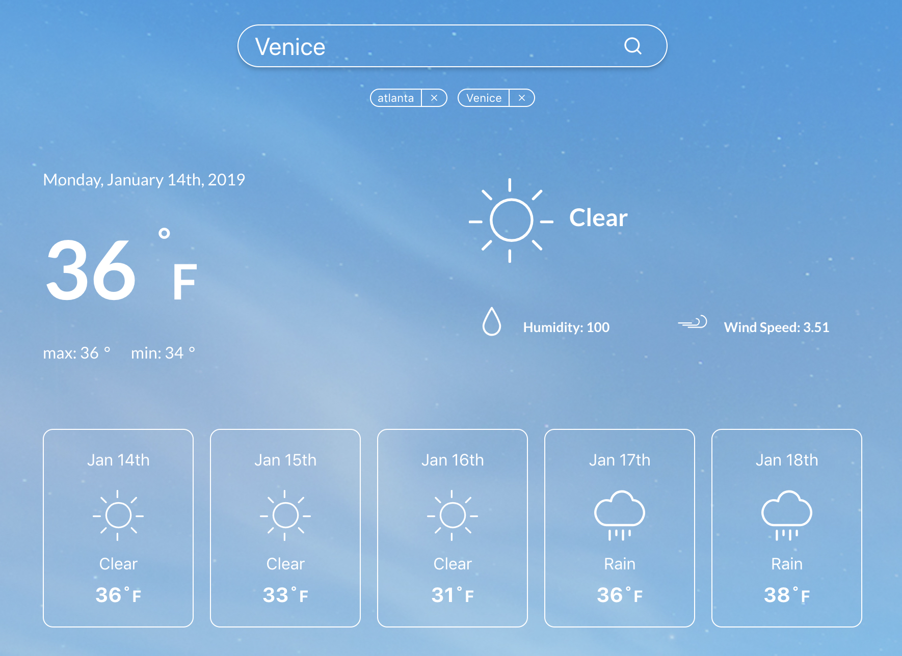
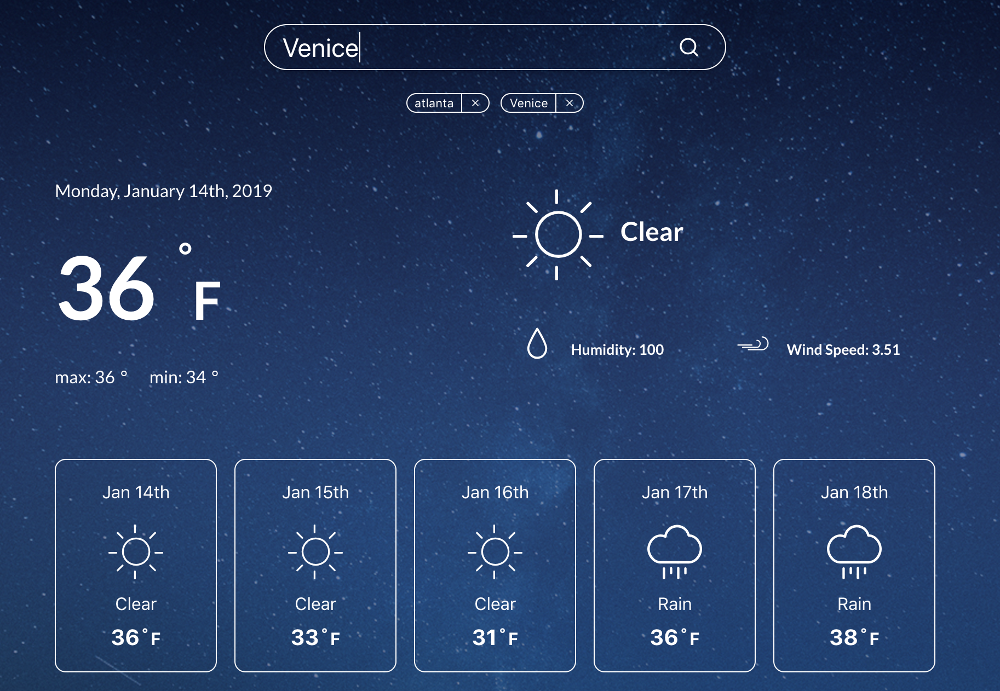

# Weather App

  

* [Overview](#overview)
* [Approach](#approach)
* [Known Limitations](#known-limitations)
* [Running Locally](#running-locally)
* [Deployment](#deployment)
* [License](#license)

# Demo

You can check out a demo here: [findniyaweather.surge.sh](https://findniyaweather.surge.sh)

# Approach

## Build Process

The build process is fully handled by the [Create React App](https://github.com/facebook/create-react-app)
default configuration, which works great for this use case. The project isn't doing anything strange
that would require anything more custom.

## Deploy Process

The project currently uses [surge.sh](https://surge.sh) with
its simple approach to deploying static sites. This is just done manually right now
whenever a deploy is desired rather than automated in some other way. 

## Styling

Styling for each component is done using React SCSS modules. This keeps the CSS clean
and easy to read. Some cool UI style features include dynamic weather icons, 
day and night mode.

  
  

## Weather Information

The Yahoo API that was recommended is no longer active this year. The project uses an
alternative API called [OpenWeatherMap](https://openweathermap.org).
Unfortunately, OpenWeatherMap doesn't accept a free form string for location
search, so the project uses a second API called [OpenCage](https://www.opencage.com).
OpenCage geocodes the input to retrieve its latitude and longitude, which is then
passed to OpenWeatherMap. A second OpenWeatherMap endpoint is used to pull up weather
data for existing locations using `cityId`.

# Known Limitations

## Weather Data
The OpenWeatherMap free tier only gives us data in 3 hour blocks for five days rather
than a daily summary. Currently, the project samples one of these 3 hour blocks
and implies that its the weather for the day.

## State Management
The project uses basic React state to manage data without any external libraries. This
can work fairly well for these limited set of requirements; however, it can still
get messy and make it hard to test business logic independently of React components. 
However, I've isolated the use of React state to just one parent container. This makes
it fairly easy to swap out the state into Redux or something like it later.

## Testing

Our tests will never fail because we have none! Due to the short turnaround time, I 
chose not to incorporate tests. However given more time, I would've added Jest tests
for any of the utility functions as well as snapshot tests for many of the components.
I would also consider using something like Cypress to do full end-to-end tests.

# Running Locally

1. Clone the repo

1. Install packages via `$ yarn install`

1. Copy the `.env.example` to `.env`

1. Fill in the `.env` with the relevant API keys from external providers

1. Start the development server via `$ yarn start`

1. Code to your ♡'s content

# Deployment

1. Build the project with `$ yarn build`.
Note that the values in your `.env` will be the keys then used in production.

1. Deploy the project to any static file hosting site.

Note: If you want to use `surge`, then you can just run `$ yarn deploy`. The prompts
will guide you through the rest.

# License

This project is licensed under the [MIT License](./LICENSE)

# Contributions

This project is maintained by [FindNiya](https://www.findniya.com/). 
